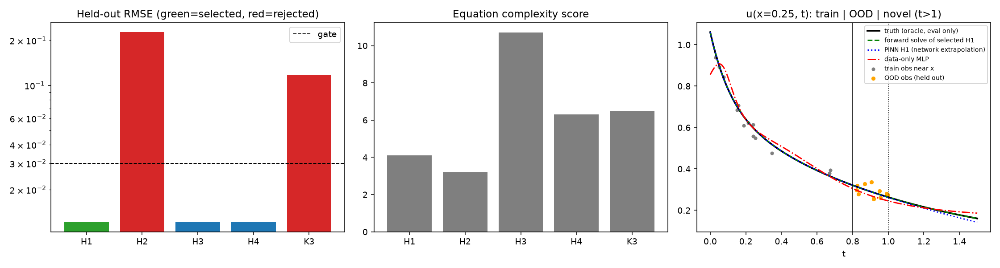

# Phase 6 -- Physics-Constrained Generative Search: Report

LLM provider: `MockLLMProvider` (mode: evidence-grounded). **With the mock provider, LLM candidates are canned; nothing here is evidence that an LLM discovered a law.**

## 1. Scientific evidence (RAG + KG)

Mechanisms surfaced by retrieval: ['advection', 'diffusion', 'reaction']  
Documented generic equation forms: ['u_t + c*u_x = 0', 'u_t = D*u_xx', 'u_t = r*u*(1-u/K)']  
Answer-leakage check (D_true string in corpus): none found

## 2. Hypotheses (candidate pool)

| ID | Origin | Equation |
|---|---|---|
| H1 | llm | `u_t = D*u_xx` |
| H2 | llm | `u_t + c*u_x = 0` |
| H3 | llm | `u_t = D*u_xx + r*u*(1 - u/K)` |
| H4 | llm | `u_t + c*u_x = D*u_xx` |
| K3 | kg_template | `u_t = r*u*(1-u/K)` |

Removed as structural duplicates: K1 (= H2), K2 (= H1)

## 3. Structural validation and 4. Physics filtering

| ID | Structural | Physics pre-check | Warnings |
|---|---|---|---|
| H1 | True | True | - |
| H2 | True | True | First order in x with Dirichlet data at BOTH ends: over-determined for a hyperbolic equation (only the inflow boundary can be prescribed). |
| H3 | True | True | - |
| H4 | True | True | - |
| K3 | True | True | No spatial derivative: boundary conditions are not coupled to the dynamics (each point evolves independently); BCs can hold only if the dynamics preserve them. |

## 5. Parameter estimation (inverse PINN) and 6. PINN validation

Trained on t <= 0.8 (train split only). Gate uses the held-out in-distribution split of NOISY observations.

| ID | Params | Val RMSE | Physics residual | IC loss | Bounds OK | Status | Failed checks |
|---|---|---|---|---|---|---|---|
| H1 | D=0.10015 | 0.0122 | 2.22e-05 | 9.01e-07 | True | supported by the available observations and physics constraints | - |
| H2 | c=0.0082094 | 0.2267 | 7.74e-03 | 2.53e-02 | True | rejected under the tested conditions | val_rmse, ic_loss |
| H3 | D=0.10076, r=0.018832, K=1.1822 | 0.0121 | 3.05e-05 | 8.50e-07 | True | supported by the available observations and physics constraints | - |
| H4 | c=-0.0017795, D=0.10002 | 0.0121 | 2.90e-05 | 1.08e-06 | True | supported by the available observations and physics constraints | - |
| K3 | K=6.9792, r=-1.4332 | 0.1169 | 1.80e-03 | 5.35e-03 | True | rejected under the tested conditions | val_rmse |

## 7. Model selection

Rule: gate -> val_rmse within 5% of best -> lowest complexity -> lowest BIC.

Best held-out RMSE 0.01211; equivalence cutoff 0.01271; equivalence set ['H1', 'H4', 'H3'].

| ID | Complexity | BIC | Per-parameter contribution (RMS share of u_t) | Inactive | Reduced form | Bootstrap sign-stable |
|---|---|---|---|---|---|---|
| H1 | 4.1 | -2214.7 | D:1.000 | - | - | True |
| H2 | 3.2 | -805.6 | c:0.243 | - | - | False |
| H3 | 10.7 | -2204.1 | D:1.003, r:0.005, K:0.005 | ['r', 'K'] | `-D*u_xx + u_t = 0` | True |
| H4 | 6.3 | -2209.1 | c:0.003, D:1.000 | ['c'] | `-D*u_xx + u_t = 0` | False |
| K3 | 6.5 | -1011.3 | K:0.104, r:0.999 | - | - | True |

**Selected: H1** (`u_t = D*u_xx`). BIC minimizer: H1 (agrees with selection: True).

- H1: selected
- H3: fits equivalently but is more complex; inactive parameters ['r', 'K']; with inactive terms removed it reduces to the selected equation
- H4: fits equivalently but is more complex; inactive parameters ['c']; with inactive terms removed it reduces to the selected equation

Empirical stability (bootstrap OLS on finite-difference derivatives of 20 random 80% subsets; NOT Bayesian):

- H1: `u_xx` mean 0.1102 ± 0.0029, sign-consistent 100%
- H2: `u_x` mean -0.01032 ± 0.013, sign-consistent 85%
- H3: `u_xx` mean 0.1127 ± 0.0038, sign-consistent 100%; `u` mean -0.6718 ± 0.15, sign-consistent 100%; `u**2` mean 1.155 ± 0.21, sign-consistent 100%
- H4: `u_xx` mean 0.1105 ± 0.0031, sign-consistent 100%; `u_x` mean 0.008768 ± 0.028, sign-consistent 80%
- K3: `u` mean -1.741 ± 0.14, sign-consistent 100%; `u**2` mean 1.203 ± 0.28, sign-consistent 100%

**Methods disagree** (reported, not resolved):
- H3: PINN finds ['r', 'K'] inactive, but the FD bootstrap gives a sign-stable `u**2` coefficient (1.16)
- H3: PINN finds ['r', 'K'] inactive, but the FD bootstrap gives a sign-stable `u` coefficient (-0.672)
The same spurious `u`/`u**2` terms appear in Phase 2's noisy full-library SINDy result, which points to a finite-difference reconstruction/smoothing artifact on 400 noisy points rather than real reaction physics; the PINN analysis fits the scattered data directly without grid reconstruction. This is an interpretation, not a proof. The FD bootstrap's `u_xx` coefficient (~0.11) is also biased high relative to the PINN estimate, consistent with that artifact.

## 8. OOD prediction

Held-out observations with t > 0.8 were never used for training or selection.

| Model | In-dist held-out RMSE (noisy obs) | OOD RMSE (noisy obs) | OOD RMSE vs clean field (oracle, eval only) |
|---|---|---|---|
| H1 | 0.01215 | 0.01159 | 0.00220 |
| H2 | 0.22667 | 0.32473 | 0.33177 |
| H3 | 0.01212 | 0.01200 | 0.00361 |
| H4 | 0.01211 | 0.01179 | 0.00305 |
| K3 | 0.11694 | 0.10262 | 0.09899 |
| MLP_data_only | 0.02139 | 0.01780 | 0.01389 |
| forward_solve_H1 | nan | 0.01131 | nan |

Noisy-observation RMSE has a floor at the measurement noise (~0.012); the oracle column shows error against the noise-free field.

**Novel prediction** (selected law solved forward from the known IC to t = 1.5, beyond the observed window, using no observations at all): oracle RMSE 0.00003 on (0.8, 1.0] and 0.00013 on (1.0, 1.5].
Selected-parameter relative error vs hidden truth (oracle): 0.0015328228473662775

## 9. Limitations -- what cannot be concluded

- The candidate was **supported by the available observations, physics constraints and OOD validation**. That is not proof, and not uniqueness: nested candidates fit equally well; selection between them is a stated parsimony rule.
- Synthetic data from a known PDE; one physical system; one noise level; 400 points.
- Mock LLM: candidate proposals are canned. KG templates come from a 5-document hand-written fixture corpus.
- Empirical stability is a finite-difference regression bootstrap, not PINN retraining and not Bayesian uncertainty.
- The initial condition is supplied as known physics, not inferred.
- Thresholds are hand-set (fixed before the run) and were not calibrated on an independent benchmark.
